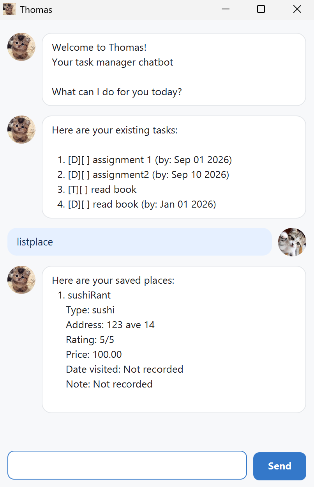

# Thomas User Guide

**Thomas** is a friendly desktop chatbot for managing tasks and saving places you want to remember.

Type a command in the message box and press **Enter** or select **Send**. Thomas saves changes automatically,
so your tasks and places are restored the next time you open the app.



## Quick start

Try these commands:

```text
todo Read chapter 3
deadline Submit report /by 2026-09-30 1800
event Project meeting /from 2026-09-25 1400 /to 2026-09-25 1500
list
```

Type `/help` at any time to see the command summary, or `bye` to close Thomas.

> **Tip:** Commands and field names are lowercase. Extra spaces around command arguments are accepted.

## Command summary

| Purpose | Command |
|---|---|
| Add a todo | `todo DESCRIPTION` |
| Add a deadline | `deadline DESCRIPTION /by DATE_TIME` |
| Add an event | `event DESCRIPTION /from DATE_TIME /to DATE_TIME` |
| List tasks | `list` |
| Find tasks | `find KEYWORD` |
| List tasks on a date | `on DATE` |
| Mark a task complete | `mark INDEX` |
| Mark a task incomplete | `unmark INDEX` |
| Delete a task | `delete INDEX` |
| Add a place | `place NAME /type TYPE /at ADDRESS /rating 1-5 /price AMOUNT` |
| List places | `listplace` |
| Find places | `findplace KEYWORD` |
| Edit a place | `editplace INDEX /FIELD VALUE` |
| Request place deletion | `deleteplace INDEX` |
| Confirm place deletion | `confirmdeleteplace INDEX` |
| Show help | `/help` |
| Exit | `bye` |

Task and place numbers are separate. A place never appears in `list`, and a task never appears in `listplace`.

## Managing tasks

### Adding a todo: `todo`

Use a todo for a task without a date.

```text
todo Read chapter 3
```

### Adding a deadline: `deadline`

Use a deadline for a task that must be completed by a date or time.

```text
deadline Submit report /by 2026-09-30
deadline Submit slides /by 30/9/2026 1800
```

### Adding an event: `event`

An event requires a start and an end. Its end must be after its start.

```text
event Project meeting /from 2026-09-25 1400 /to 2026-09-25 1500
```

### Supported dates and times

Task dates accept either of these formats:

- `YYYY-MM-DD`, for example `2026-09-25`
- `D/M/YYYY`, for example `25/9/2026`

Add an optional 24-hour time in `HHmm` format, such as `0900` or `1830`.

Thomas rejects impossible dates such as `2026-02-30` and times such as `2500`.

### Viewing and finding tasks

- `list` displays every task and its current number.
- `find KEYWORD` searches task descriptions without regard to letter case.
- `on DATE` displays deadlines and events occurring on that date.

Examples:

```text
find report
on 2026-09-30
```

### Completing and deleting tasks

Use the task number shown by `list`:

```text
mark 2
unmark 2
delete 2
```

Task numbers can change after a task is deleted, so run `list` again when unsure.

## Managing saved places

### Adding a place: `place`

```text
place Ichiban Sushi /type Japanese restaurant /at 10 Anson Road /rating 4 /price 28.50
```

You may also record a visit date and note:

```text
place Ichiban Sushi /type Japanese restaurant /at 10 Anson Road /rating 4 /price 28.50 /visited 2026-09-12 /note Great lunch
```

The following fields are required:

- `NAME`, `TYPE`, and `ADDRESS` must contain text.
- `RATING` must be a whole number from 1 to 5.
- `AMOUNT` must be non-negative and have no more than two decimal places.
- `VISITED`, when provided, must be a valid `YYYY-MM-DD` date.

Each `/field` may appear only once. Text cannot contain `|` or line breaks because Thomas uses those characters
to separate fields in its data files.

### Listing and finding places

```text
listplace
findplace sushi
```

`findplace` searches names without regard to letter case. Search results retain their number from the complete
place list, so that number can be used with `editplace` or `deleteplace`.

### Editing a place: `editplace`

Each edit command changes exactly one field:

```text
editplace 1 /name New name
editplace 1 /type Cafe
editplace 1 /at New address
editplace 1 /rating 5
editplace 1 /price 15.90
editplace 1 /visited 2026-09-15
editplace 1 /note Quiet in the afternoon
```

Clear an optional field with `none`:

```text
editplace 1 /visited none
editplace 1 /note none
```

### Deleting a place

Place deletion requires confirmation to prevent accidents:

```text
deleteplace 1
confirmdeleteplace 1
```

The confirmation must be the next command and must use the same number. Any other command—including an invalid
one—cancels the pending deletion.

## Understanding errors

Errors appear in a highlighted response. Thomas explains what needs to be corrected and keeps your existing data
unchanged. Common causes include:

- a required description, date, or place field is missing;
- a command contains an unsupported or repeated field;
- a task or place number does not exist;
- a date, time, rating, or price has an invalid value;
- an identical task or place already exists.

Correct the command and send it again. Use `/help`, `list`, or `listplace` when you need the expected syntax or a
current item number.

## Data storage

Thomas stores data locally in the project folder:

- tasks: `data/thomas.txt`
- places: `data/places.txt`

Missing files are created automatically. If an individual saved record is malformed, Thomas skips that record and
continues loading the remaining valid records.

> **Warning:** Avoid editing the data files while Thomas is running. Keep backups before changing them manually.

## Command reference conventions

- Words in `UPPERCASE` are values that you replace, such as a description or number.
- Text in `[square brackets]` is optional.
- Do not type the brackets themselves.
- Indices start at 1.
